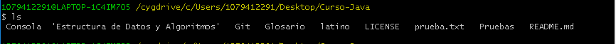
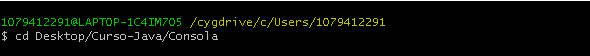
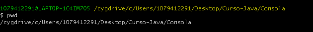
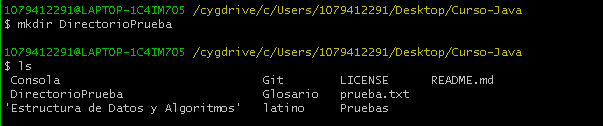
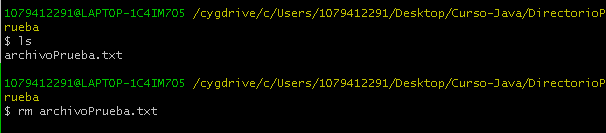

# Comandos basicos en consola, Linux

##  **ls** ##

Este comando, lista los archivos y carpetas del directorio actual.



### **Parámetros** ###

* ls -a

Muestra los archivos y directorios  del directorio actual incluyendo los archivos y directorios ocultos.

* ls -l

Muestra información un poco mas detalla de los archivos y directorios tales como: nombre, permisos, propietario, fecha y hora de la  modificacion (formato largo) y muestra la suma del tamaño de los archivos.

* ls -tl

el parametro "t" muestra los archivos en orden de modificación. los mas recientes primero.

> el parámetro "l" hara la misma funcion antes mencionada.

* ls -r

Este comando invirte la lista de los archivos.

* ls -ltr

Este comando nos muestra los archivos por orden de modificacion, siendo el ultimo el mas reciente.


##  **cd** ##

Este comando, nos permite navegar y accesar a los directorios de nuestro sistema.

```Shell
cd [Ruta del directorio]
```



### **Opciones** ###

* cd..

Retrocede al directorio anterior.

* cd /

Regresa directamente a la raiz de nuestro sistema.

##  **pwd** ##

Este comando, muestra la ruta del directorio en el que nos encontremos ubicados.




##  **mkdir** ##

Este comando, nos permite crear un nuevo directorio (carpeta).

```Shell
mkdir [nombre de la carpeta]
```


##  **rm** ##

Este comando, nos permite eliminar un archivo deseado.

```Shell
rm [nombre del archivo a eliminar]
```



##  **mv** ##

Este comando, nos permite mover archivos y directorios en concreto, de una ubicación a otra.

```Shell
mv nombreArchivo [ruta destino]
```

##  **cp** ##

Este comando, nos permite copiar archivos y directorios, en el sistema.

```Shell
cp nombreArchivo [ruta destino]
```
