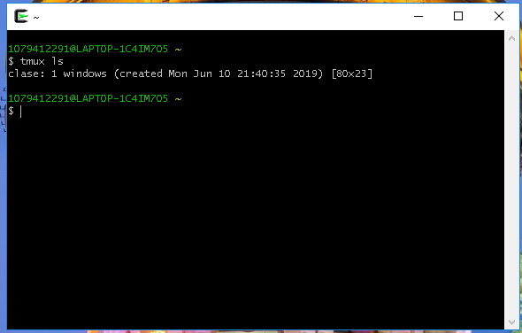

#### Comandos Iniciales de consola
> Nota: tmux es un multiplexor de terminal para sistemas tipo Unix.

1. Comando para abrir tmux

```Shell
		tmux
```

2. Comando para ver el listado de terminales de tmux

```Shell
		tmux ls
```



3. Comando para re-ingresar a una terminal que esta abierta.

```Shell
		tmux attach-session -t [nombre de la sesion]
```
