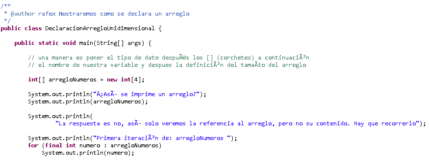
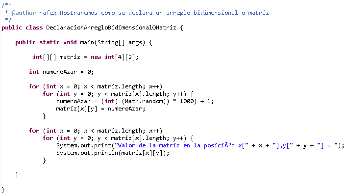

# Algoritmos #

"Un algoritmo es un conjunto de instrucciones que especifican la secuencia de operaciones o pasos a realizar, en orden, para resolver un problema en especifico."

Caracteristicas de un algoritmo :

* Un algoritmo debe ser preciso y llevar un orden en la realización de cada paso.

* Un algoritmo debe ser definido.
(se debe obtener el mismo resultado, las veces que se realize)
* Un algoritmo debe ser finito. (termina en algun momento)


**Tipos de algoritmos**

* Cualitativos

Son aquellos en los que se describen los pasos utilizando palabras.

* Cuantitativos

Son aquellos en los que se utilizan cálculos numericos para definir los pasos del proceso.

# Estructuras de Datos #

Las estructuras de datos son una colección de datos cuya organización se caracteriza por las funciones de acceso que se usan para almacenar y acceder a elementos individuales de datos.

Debido a que por lo general tenemos que tratar con conjuntos de datos y no con datos simples, es necesario tratar con estructuras de datos adecuadas a cada necesidad.

Caracteristicas de una Estructura de Datos :

 - Pueden descomponerse en los elementos que la confoman.

*  La manera en que se colocan los elementos dentro de la estructura, afectará la forma en que se realicen los accesos a cada elemento.

* La colocación de los elementos y la manera en que se accede a ellos, puede ser encapsulada.

La información que se procesa en la computadora, es un conjunto de datos que pueden ser simples o estructurados.

 **Datos Simples**

 Son aquellos que ocupan sólo una localidad de memoria.

**Datos Estructurados**

 Son un conjunto de casillas de memoria a las cuales hacemos referencia mediante un identificador único.

#### **_Tipos de Datos_** ####

El tipo de un dato, es el conjunto de valores que puede tomar durante el programa. Si se le intenta dar un valor fuera del conjunto, se producira un error.

La asignación de tipos a los datos, tiene dos objetivos principales:

* Detectar errores en las operaciones.
* Determinar como ejecutar estas operaciones.

####  **_Clasificaciones en Los Tipos de Datos_** ####

* Dinámicos

* Estáticos
	* Tipo Cadena
	* Estructurados
	* Simples
		* Ordinales
		* No Ordinales

**Tipos Dinamicos**

Este tipo nos permite tener un mayor control, sobre la gestion de memoria en nuestros programas.

> Se puede manejar el tamaño de las variables en tiempo de ejecución.

**Tipos Estáticos**

Una vez declarada una variable, a esta se le asigna un espacio de memoria fijo y este espacio no se podra aumentar, ni disminuir.

> El tamaño que ocupa en memoria, NO puede variar durante la ejecuación del programa.

**Tipos Estructurados**

Los tipos de datos estructurados, se refieren a colecciones de elementos.

**Tipos Simples**

Los tipo simples mas basicos son : entero, logico, caracter y real. La mayoria de los lenguajes de programación, los soportan.

**Tipos Ordinales**

Se dice que es ordinal por que el conjunto de valores que representa se puede contar, es decir, podemos establecer una relación uno a uno entre sus elementos y el conjunto de los numeros naturales.

Los mas importantes son: entero, logico y caracter

Para que un conjunto se considere ordinal se tiene que poder calcular la posición, el anterior y el siguiente elemento, de un elemento cualquiera del conjunto.

**Tipos NO-Ordinales**

Este tipo nos sirve para declarar variables que pueden tomar valores, dentro del conjunto de los numeros reales.

 - No se puden contar
 - No se pude establecer una relación uno a uno

# Arreglos #

Un arreglo puede definirse como un grupo o una colección finita, homogénea y ordenada de elementos.

Finita :

todo arreglo tiene un limite, es decir, sabe determinar cual sera el número maximo de elementos, que podran formar parte del arreglo.

Homogenea :

todos los elementos del arreglo son del mismo tipo.

Ordenada :

se puede determinar cual sera el primero, segundo, tercero, n . . . elemento.

tipo de arreglos:

- De una dimensión.
- De dos Dimensiones.
- De tres o mas dimensiones.

####  **_Arrglos Unidimensionales_** ####

Un arreglo unidimensional es un tipo de dato estructurado, que esta formado de una colección finita y ordenada de datos del mismo tipo.

Es la estructura natural para modelar listas de elementos iguales.

El tipo de acceso a los arreglos udimensionales, es el acceso directo, es decir, podemos acceder a cualquier elemento del arreglo, sin tener que consultar a elementos anteriores o posteriores, esto mediante el uso de un indice para cada elemento del arreglo que nos da su pocisión relativa.

Para implementar arreglos unidimensionales se debe reservar espacio en memoria y se debe proporcionar la direccion base del arreglo, la cuota superior y la inferior.

**Declaración**

```Shell
tipo identificador [];
```
o bien
```Shell
tipo [] identificador;
```
donde

tipo : es el tipo de dato, de los elementos del vector.

identificador : es el identificador de la variable.

**Creación**

```Shell
vector = new tipo [elementos]
```
tipo : debe coincidir, con el tipo con el que se haya declarado el vecto.

vector : debe ser una variable declarada como tipo []

> entre corchetes se indica el tamaño del vector

Ejemplos :
```Shell
1.
float [] notas = new float [ALUMNOS];

2.
int [] temperaturas = new int [7];
```


####  **_Arrglos Bidimensionales_** ####

Un arreglo bidimensional es un tipo de dato estructurado finito ordenado y homogeneo. El acceso a ellos es mediante el acceso directo por medio de un par de indices.

Los arreglos bidimensionales se utilizan para representar datos que puden verse como una tabla con filas y columnas.

La primera dimension del areglo representa las columnas, cada elemento contiene un valor y cada dimensión representa una relación.

La representación en memoria se realiza de dos formas: almacenamiento por columnas o por renglones.

**Declaración**
```Shell
tipo identificador [][];
```
o bien

```Shell
tipo [][] identificador;
```
**Creación**

```Shell
matriz = new tipo [filas] [columnas];
```
Ejemplo

```Shell
int [][] temperaturas = new int [12][31];
```


# Cadenas de Caracteres #

Una cadena de caracteres, es un vetor de caracteres.
