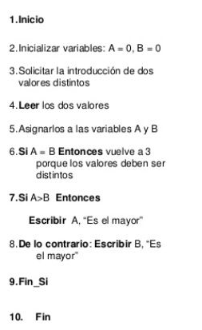
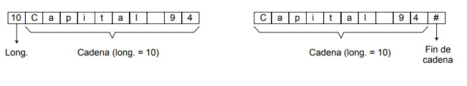

# Algoritmos #

"Un algoritmo es un conjunto de instrucciones que especifican la secuencia de operaciones o pasos a realizar, en orden, para resolver un problema en especifico."

Caracteristicas de un algoritmo :

* Finito : Un algoritmo siempre termina, después de un número finito de pasos.

* Definido : Cada paso de un algoritmo debe ser definido de manera precisa, estableciendo las acciones que van a efectuar clara y rigurosamente, en cada paso.

* Efectivo : Un algoritmo debe ser efectivo, considerando, su tiempo de ejecución, adaptabilidad, simplicidad y elegancia.

**Tecnicas para la formulación de algoritmos**


* Diagramas de Flujo.

Un diagrama de flujo es la representación de un algoritmo, es decir, representa delladamente en forma gráfica de como deben realizars, los pasos en la computadora, para producir resultados.

**Simbologia**


* Pseudo-código

el pseudo-código es una mezcla de lenguaje de programación y español (o cualquier otro idioma) que se emplea, dentro de la programación estructurada, para realizar el diseño de un programa.

El pseudo-código se puede definir como la representación narrativa de los pasos que debe seguir un algoritmo para dar solución a un problema determinado.

El pseudo-código utiliza palabras, que indican el proceso a realizar.

**ejemplo :**



# Estructuras de Datos #

Las estructuras de datos son una colección de datos cuya organización se caracteriza por las funciones de acceso que se usan para almacenar y acceder a elementos individuales de datos.

Debido a que por lo general tenemos que tratar con conjuntos de datos y no con datos simples, es necesario tratar con estructuras de datos adecuadas a cada necesidad.

La información que se procesa en la computadora, es un conjunto de datos que pueden ser simples o estructurados.

 **Datos Simples**

 Son aquellos que ocupan sólo una localidad de memoria.

**Datos Estructurados**

 Son un conjunto de casillas de memoria a las cuales hacemos referencia mediante un identificador único.

#### **_Tipos de Datos_** ####

El tipo de un dato, es el conjunto de valores que puede tomar durante el programa. Si se le intenta dar un valor fuera del conjunto, se producira un error.

La asignación de tipos a los datos, tiene dos objetivos principales:

* Detectar errores en las operaciones.
* Determinar como ejecutar estas operaciones.

####  **_Clasificaciones en Los Tipos de Datos_** ####

* Dinámicos

* Estáticos
	* Tipo Cadena
	* Estructurados
	* Simples
		* Ordinales
		* No Ordinales

**Tipos Dinamicos**

Este tipo nos permite tener un mayor control, sobre la gestion de memoria en nuestros programas ya que no tienen limitaciones o restricciones en el tamaño de memoria ocupada.

Mediante el uso de un tipo de dato especifico (puntero) es posible construir estructutras de datos dinamicas, ofreciendo soluciones eficaces y efectivas, en la solución de problemas complejos.

se caracterizan por el hecho, de que con un nombre, se hace referencia a un grupo de casillas de memoria.

Las variables que se crean y estan disponibles durante la ejecución del programa, se llaman variables continuas.

De esta manera se pueden adquirir posiciones adicionales de memoria, a medida que se necesiten durante la ejecución del programa y liverarlas cuando no se necesiten.

**Tipos Estáticos**

Son aquellas en las que el tamaño ocupado en memoria, se definen antes de que el programa se ejecute y no puede modificarse dicho tamaño durante la ejecución del programa.

Su principal caracteristica es que ocupan, solo una casilla de memoria, por lo tanto, una variable simple hace referencia a un unico valor a la vez.

Una vez declarada una variable, a esta se le asigna un espacio de memoria fijo y este espacio no se podra aumentar, ni disminuir.

**Tipos Estructurados o Compuestos**

Los tipos de datos estructurados, se refieren a colecciones de elementos.

* Arreglos
* Conjuntos
* Strings

**Tipos Simples**

Los tipo simples mas basicos son : entero, logico, caracter y real. La mayoria de los lenguajes de programación, los soportan.

* Enteros
* Reales
* Caracteres
* Boleanos

**Tipos Ordinales o Lineales**

Se dice que es ordinal por que el conjunto de valores que representa se puede contar, es decir, podemos establecer una relación uno a uno entre sus elementos y el conjunto de los numeros naturales.

Los mas importantes son: entero, logico y caracter

Para que un conjunto se considere ordinal se tiene que poder calcular la posición, el anterior y el siguiente elemento, de un elemento cualquiera del conjunto.

* Pilas
* Colas
* Listas

**Tipos NO-Ordinales o NO Lineales**

Este tipo nos sirve para declarar variables que pueden tomar valores, dentro del conjunto de los numeros reales.

 - No se puden contar
 - No se pude establecer una relación uno a uno

* Arbol
* Grafo

# Arreglos #

Un arreglo puede definirse como un grupo o una colección finita, homogénea y ordenada de elementos.

Finita :

todo arreglo tiene un limite, es decir, sabe determinar cual sera el número maximo de elementos, que podran formar parte del arreglo.

Homogenea :

todos los elementos del arreglo son del mismo tipo.

Ordenada :

se puede determinar cual sera el primero, segundo, tercero, n . . . elemento.

tipo de arreglos:

- De una dimensión.
- De dos Dimensiones.
- De tres o mas dimensiones.

####  **_Arrglos Unidimensionales_** ####

Un arreglo unidimensional es un tipo de dato estructurado, que esta formado de una colección finita y ordenada de datos del mismo tipo.

Es la estructura natural para modelar listas de elementos iguales.

El tipo de acceso a los arreglos udimensionales, es el acceso directo, es decir, podemos acceder a cualquier elemento del arreglo, sin tener que consultar a elementos anteriores o posteriores, esto mediante el uso de un indice para cada elemento del arreglo que nos da su pocisión relativa.

Para implementar arreglos unidimensionales se debe reservar espacio en memoria y se debe proporcionar la direccion base del arreglo, la cuota superior y la inferior.

**Declaración**

```Shell
tipo identificador [];
```
o bien
```Shell
tipo [] identificador;
```
donde

tipo : es el tipo de dato, de los elementos del vector.

identificador : es el identificador de la variable.

**Creación**

```Shell
vector = new tipo [elementos]
```
tipo : debe coincidir, con el tipo con el que se haya declarado el vecto.

vector : debe ser una variable declarada como tipo []

> entre corchetes se indica el tamaño del vector

Ejemplos :
```Shell
1.
float [] notas = new float [ALUMNOS];

2.
int [] temperaturas = new int [7];
```


####  **_Arrglos Bidimensionales_** ####

Un arreglo bidimensional es un tipo de dato estructurado finito ordenado y homogeneo. El acceso a ellos es mediante el acceso directo por medio de un par de indices.

Los arreglos bidimensionales se utilizan para representar datos que puden verse como una tabla con filas y columnas.

La primera dimension del areglo representa las columnas, cada elemento contiene un valor y cada dimensión representa una relación.

La representación en memoria se realiza de dos formas: almacenamiento por columnas o por renglones.

**Declaración**
```Shell
tipo identificador [][];
```
o bien

```Shell
tipo [][] identificador;
```
**Creación**

```Shell
matriz = new tipo [filas] [columnas];
```
Ejemplo

```Shell
int [][] temperaturas = new int [12][31];
```


# Cadenas de Caracteres #

Una cadena de caracteres, es un vector de caracteres.



**Operaciones con cadenas de caracteres :**

* Asignación.
* Concatenación.
* Búsqueda.
* Extracción.
* Comparación.

**Tipos de Cadenas**

* Dinamicas : pueden alterar su longitud, en tiempo de ejecución.

* Estaticas : su longitud es fija, a lo largo del tiempo de ejecución.
