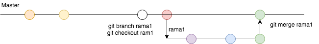

# Git

#### Comandos Iniciales

1. El comando que sirve para clonar repositorios en local es :
```Shell
git clone https://github.com/carloshernandezfabian/Curso-Java.git

```
2. El siguiente comando sirve para ver el estado en el que esta el repositorio :
```Shell
git status
```

3. El siguiente comando nos notifica los cambios que hay en nuestro repositorio.

```Shell
git fetch origin
```

4. El siguiente comando trae los cambios del servidor a tu local.

```Shell
git pull origin [nombre de la rama]
```

#### Comandos para subir cambios al servidor

1. Primero verificamos el estado en el que esta el repositorio:
```Shell
git status
```

2. Agregamos los archivos que fueron modificados
```Shell
git add [nombre completo del archivo]
```

2.1 si deseamos agregar todos los archivos utilizamos el siguiente comando

```Shell
git add .
```

3. Una vez agrgados los archivos hacemos commit

```Shell
git commit -m "mensaje"
```
4. Despues del commit ya se puede hcaer **push** al servidor

```Shell
git push origin [nombre de la rama]
```
#### Archivos de configuracion de repositorio

+ En el archivo **.gitignore** Agregamos el nombre de los archivos que deseamos ignorar, para que no se suban al repositorio.

+ En la carpeta **.git** se encuentran las configuraciones de nuestro repositorio localmente, y dentro de el hay un archivo que se llama **config** que contiene el **origin**, que es hacia donde apunta nuestro repositorio, por ejemplo:
```Shell
[remote "origin"]
	url = https://github.com/carloshernandezfabian/Curso-Java.git
	fetch = +refs/heads/*:refs/remotes/origin/*
```

#### Manejo de ramas
##### Creacion de ramas

1. Comando para crear una rama en Git :

```Shell
git branch [nombre de la rama]
```

2. para poder cambiar de rama utilizamos el comando :

```Shell
git checkout [nombre de la rama]
```

2.1 Comando para crear y cambiar de rama utilizamos el siguiente comando.

```Shell
git checkout -b [nombre de la nueva rama]
```

3. para ubicar la rama en la que nos encontramos, utilizamos el comando:

```Shell
git branch
```

4. Para subir o publicar la rama es el siguiente comando:

```Shell
git push origin [nombre de la rama que se creo]
```
#### Integración de ramas

1. Posicionarse en la rama que queremos integrar los cambios, por ejemplo los cambios de rama1 a master

```Shell
git checkout master

git merge rama1
```

> Nota: si el merge no genero conflicto podemos hacer el push sin problemas.

```Shell
git push origin master
```


> Nota: si el merge genero conflicto debemos solucionar primero los conflictos, para subir los cambios, ejemplo:


una vez solucionado los conflictos podemos subir los cambios.
