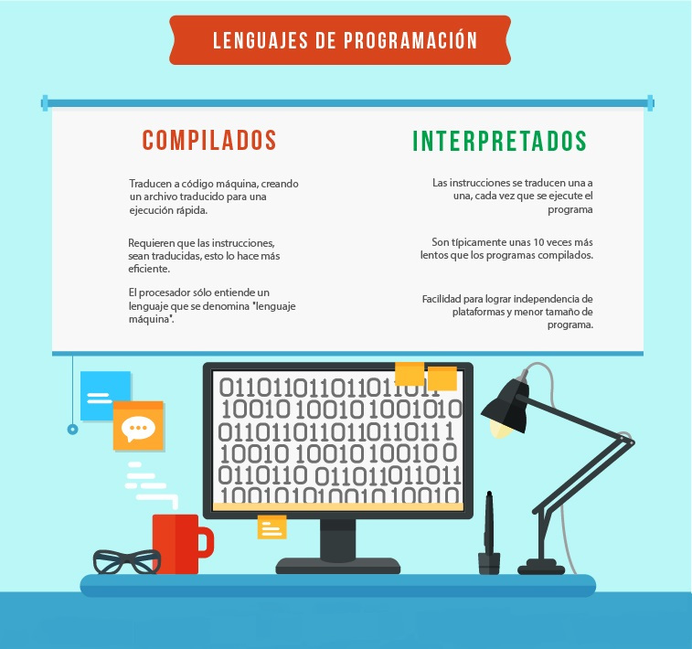

# Lenguaje de Programación

**Definición :**

Un luenguaje de Programación es un conjunto de símbolos, reglas sintácticas y semánticas, que definen su estructura y el significado de sus elementos y expresiones.

Es utilizado para controlar el comportamiento físico y lógico de una máquina(computadora).

Un lenguaje de Programación permite especificar de manera precisa, sobre que datos debe operar una computadora,cómo estos datos deben ser almacenados ó transmitidos y que acciones debe tomar bajo una variada gama de circustancias.

**Clasificación :**

* Nivel de Abstracción.
* Forma de ejecución.
* Paradigma de Programación

## Nivel de Abstracción

* **Lenguaje maquina y de bajo nivel**

Los lenguaje máquina, están escritos en código directamente intangible por la computadora, ya que son instrucciones en cadenas binarias (0 y 1).

La programación en un lenguaje de bajo nivel tiene como ventajas una mayor adaptación al equipo, además de la posibilidad de obtener la máxima velocidad con el mínimo uso de memoria.

Sin embargo, tiene importantes incovenientes, como la imposibilidad de escribir código independiente de la maquina, mayor dificultad en la programación y comprensión de los programas.

* **Lenguajes de medio nivel**

Minoritariamente en algunos textos se diferencian algunos lenguajes como de medio nivel, como el lenguaje C, ya que tienen ciertas características que los acercan a los lenguajes de bajo nivel, como gestión de punteros de memoria y registros, pero con sintaxis, vocabulario y gramática de alto nivel.

* **Lenguajes de alto nivel y de muy alto nivel**

Los lenguajes de programación de alto nivel se caracterizan por expresar los algoritmos de una manera adecuada a la capacidad cognitiva humana, en lugar de estar orientados en su ejecución a las máquinas.

Los lenguajes de muy alto nivel, se crearon para que el usuario cómun, pudiese solucionar ciertos problemas sencillos de procesamiento de datos, de una manera más fácil y rápida.

Los lenguajes de bajo y alto nivel requieren de conocimientos específicos de programación y de el lenguaje en concreto (vocabulario, gramática y sintaxis) para realizar las secuencias de instrucciones lógicas.

## Forma de Ejecución

* **Lenguajes Compilados**

Antes de poder utilizarse el programa, de be utilizarse un traductor llamado **"compilador"** que se encarga de traducir **("compilar")** el programa original **("codigo fuente")** al programa equivalente escrito en lenguaje maquina o ensamblador **("binario")**. Los binarios son los programas ejecutables y los únicos necesarios para el funcionamiento del programa.

* **Lenguajes Interpretados**

Cada vez que se usa el programa debe urilizarse un traductor llamado **"intérprete"** que se encarga de traducir **("interpretar")** las instrucciones del programa original **("código fuente")** a código maquina según van siendo utilizadas. Para el funcionamiento del programa es necesario disponer del código original y del intérprete.

**Diferencias entre lenguajes compilados e interpretados :**

* Los lenguajes compilados se compilan una vez y se utilizan cuantas veces se desee sin necesidad de volver a utilizar el compilador. Los lenguajes interpretados, son interpretados cada vez que se ejecutan y necesitan siempre del intérprete.

* Un compildor traduce cada instrucción una sola vez. Un intérprete debe traducir una instrucción cada vez que la encuentra.

* Los lenguajes compilados son más eficientes que los interpretados y además permiten distribuir el programa en forma confidencial mediante binarios.

* Los binarios son compilados para una arquitectura específica y no pueden ser utilizados en otras arquitecturas no compatibles. Un lenguaje interpretado puede ser utilizado en cualquier arquitectura que disponga de un intérprete, sin necesidad de cambios.

## Paradigma de Programación

Un paradima de programación representa un enfoque particular o filosofía para la construcción del software. Si bien, puede selecionarse la forma mas pura, de estos paradigmas a la hora de programar. en la práctica es habitual que se mezclen, dando lugar a la programación multiparadigma.

**Diferentes paradigmas de programación :**

- Algorítmico, Imperativo o por Procedimientos
- Declarativo o Predicativo
- Orientado a Objetos
