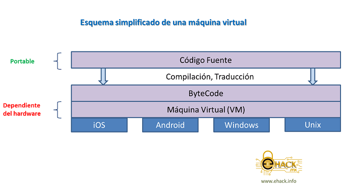
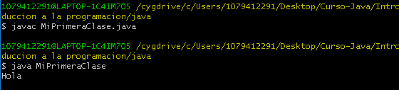

# Introducción a Java

### Java
Java es un lenguaje de programación multiplataforma, orientado a objetos, diseñado para que los desarrolladores puedan crear una sola vez sus programas y se ejecuten en cualquier plataforma.

**El modelo orientado a objetos, es mas proximo a nuestra comprensión de la realidad.**

### JDK (Java Development Kit)

El JDK, se puede definir como un conjunto de herramientas y librerias necesarias, para crear y ejecutar applets y aplicaciones en Java.

componentes del JDK:

+ Interprete.
+ Compilador.
+ Visaualizador de applets.
+ Depurador.
+ Generador de documentación.

Las variables de entorno mas improtantes son :

**javac :** Es el compilador de Java, encargado de convertir nuestro codigo fuente(.java) en bytecode(.class) el cual posteriormente sera interpretado y ejecutado por la JVM.

> Para compilar se debe poner el nombre completo del archivo, con todo y extensión.

```Shell
javac NombreArchivo.java
```

**java :** es el comando que nos permite ejecutar el código Java.

> Para ejecutarlo se debe poner el nombre de la Clase unicamente.

```Shell
java NombreClase
```


### JRE (Java Runtime Enviroment)

Es la implentación de la maquina virtual de java, actua como un intermediario entre el sistema y java.

El JRE esta compuesto por dos importantes areas, la primera son las clases que conforman el API de java y la segunda es la JVM.




+ **El API** son todas las clases que componen el ambiente java y que al momento de ser utilizadas desde la aplicación podrán ser ejecutadas y/o interpretadas por la JVM.

+ **La JVM** es un componente de software que actua justamente como una maquina virtual o un espacio virtual de memoria, donde se ejecutan las aplicaciones java.

La JVM es el programa que interpreta el codigo java,mientras que las librerias de clases estándar son las que implementan el API de java, ambas deben ser consistentes entre sí.


```java
public class MiPrimeraClase {
    public static void main(String[] args) {
      System.out.println("Hola");
    }
}
```


